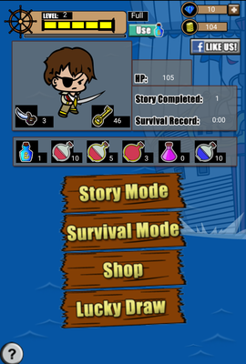

Attack on Pirates
=================

Note
============
The game is powered by [Corona SDK](https://coronalabs.com/products/corona-sdk/)

About
============
This is a mobile game which I wrote in my spare time when I was still studying in university. Since this project is no longer maintained, I apologize for any bugs or crashes if you encounter.

Unfortunately, this game has already removed from the app store, but you can still get a glimpse of the gameplay by downloading this [apk](sample.apk) to your Android devices.

Thanks
============
I want to thank the team of *Coffee Games* for their support.

Screenshots
============

Copyright
============

    Copyright 2014 Darren Poon. All rights reserved.

    Licensed under the Apache License, Version 2.0 (the "License");
    you may not use this file except in compliance with the License.
    You may obtain a copy of the License at

        http://www.apache.org/licenses/LICENSE-2.0

    Unless required by applicable law or agreed to in writing, software
    distributed under the License is distributed on an "AS IS" BASIS,
    WITHOUT WARRANTIES OR CONDITIONS OF ANY KIND, either express or implied.
    See the License for the specific language governing permissions and
    limitations under the License.